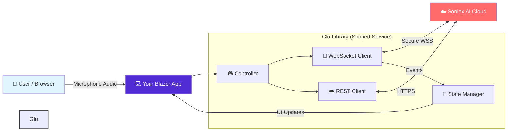

<div align="center">
  

# Glu Library

### The Enterprise .NET Client for Soniox AI

**Robust, Resilient & Secure Middleware for Real-Time Speech Recognition**

[](https://dotnet.microsoft.com/)
[](https://www.nuget.org/)
[]()
[](LICENSE)
[]()
[](https://kiroku.io)

</div>

---

## 📋 Table of Contents

- [Overview](#-overview)
- [Why Glu?](#-why-glu)
- [Architecture](#%EF%B8%8F-architecture)
- [Installation](#-installation)
- [Quick Start](#-quick-start)
- [Configuration](#-configuration)
- [Advanced Features](#-advanced-features)
    - [File Upload (REST)](#file-upload-rest)
    - [Streaming (WebSocket)](#streaming-websocket)
    - [Speaker Diarization](#speaker-diarization)
- [Dependencies](#-dependencies)

---

## 🎯 Overview

**Glu Library** is the official, production-ready .NET middleware designed to integrate **Soniox AI** speech recognition into your Blazor, ASP.NET Core, or Console applications.

It provides a unified interface for both **Real-Time Streaming (WebSocket)** and **Asynchronous File Transcription (REST)**, allowing you to easily build complex voice-enabled applications without dealing with the low-level complexities of network socket management, audio chunking, or protocol handshakes.

---

## 🚀 Why Glu?

| Feature | Description |
| :--- | :--- |
| **🛡️ Scoped Security** | Designed with `AddScoped` lifecycle to ensure data isolation between different users in Blazor Server environments. |
| **🔄 Auto-Resilience** | Built-in **Retry Policies**. If the network blips, the library automatically reconnects and restores the session context transparently. |
| **⚡ Soniox V3 Native** | Fully compatible with Soniox V3 API, optimized for ultra-low latency and token-based cost savings. |
| **👥 Dynamic Diarization** | Runtime configuration allows you to define who is the "Agent" and "Customer" dynamically for perfect transcript separation. |
| **📝 Professional Logging** | Integrated with `ILogger` to provide structured telemetry for Azure/AWS monitoring. |
| **📂 Hybrid Support** | One library for both live streaming audio and uploading pre-recorded files. |

---

## 🏗️ Architecture

Glu Library acts as a **smart proxy** inside your .NET application, mitigating the complexity of communicating with Soniox Cloud.



---

## 📦 Installation

Install the package via NuGet:

```bash
dotnet add package Glu-Library
```

---

## ⚡ Quick Start

### 1. Register Services
In your `Program.cs`, add the Glu Library services and configure your Soniox credentials.

```csharp
using Glu_Library.Extensions;

builder.Services.AddGluLibrary(options =>
{
    options.Token = "YOUR_SONIOX_API_KEY";
    options.Endpoint = "wss://api.soniox.com/v1/transcribe"; // For WebSocket
    options.Model = "en_v2"; // Default model
    options.EnableSpeakerDiarization = true;
});
```

### 2. Inject and Use (Streaming)
Inject `ISonioxWebSocketClient` into your component or service for real-time transcription.

```csharp
@inject ISonioxWebSocketClient GluClient

@code {
    protected override async Task OnInitializedAsync()
    {
        // 1. Subscribe to events
        GluClient.OnTranscriptReceived += (result) =>
        {
            Console.WriteLine($"[{result.Speaker}]: {result.Text}");
            StateHasChanged();
        };

        // 2. Connect
        await GluClient.ConnectAsync(new SonioxSessionConfig 
        { 
            ClientReferenceId = "session-123" 
        });
    }

    private async Task ProcessAudio(byte[] audioChunk)
    {
        // 3. Send Audio
        await GluClient.SendAudioAsync(audioChunk);
    }
}
```

---

## 🛠️ Configuration

You can customize the library behavior via `SonioxWebSocketOptions` in `appsettings.json`:

```json
{
  "Soniox": {
    "Token": "YOUR_API_KEY_HERE",
    "Endpoint": "wss://api.soniox.com/v1/transcribe",
    "Model": "en_v2",
    "EnableSpeakerDiarization": true
  }
}
```

---

## 🔥 Advanced Features

### File Upload (REST)
For pre-recorded audio files, use `SonioxRestClient`. It handles the multipart upload and status polling for you.

```csharp
public class TranscriptionService
{
    private readonly SonioxRestClient _restClient;

    public TranscriptionService(SonioxRestClient restClient)
    {
        _restClient = restClient;
    }

    public async Task<string> UploadAndTranscribe(Stream fileStream, string fileName)
    {
        // 1. Upload
        var fileId = await _restClient.UploadFileAsync(fileStream, fileName);
        
        // 2. Start Job
        var jobId = await _restClient.TranscribeAsync(fileId, "en_v2_long");
        
        // 3. Check Status
        return await _restClient.GetTranscriptionStatusAsync(jobId);
    }
}
```

### Streaming (WebSocket)
The WebSocket client is built for resilience. It features:
- **Automatic Reconnection**: Exponential backoff retry logic if the connection drops.
- **Session Duration Management**: Automatically disconnects after 300 minutes (configurable) to prevent zombie connections.
- **Tls 1.2+ Enforcement**: Ensures secure connections.

### Speaker Diarization
Identify who is speaking automatically.

```csharp
// In your startup config
options.EnableSpeakerDiarization = true;
```
The `TranscriptResult` object will populate the `Speaker` property (e.g., "0", "1", "2").

---

## 📦 Dependencies

- **Microsoft.Extensions.Http**: For robust HTTP client factories.
- **Microsoft.Extensions.Logging**: For standard logging interfaces.
- **System.Net.WebSockets.Client**: For the core streaming implementation.

---

<div align="center">
  <p>Built with ❤️ by <a href="https://kiroku.io">Kiroku</a>. Open Source.</p>
</div>
